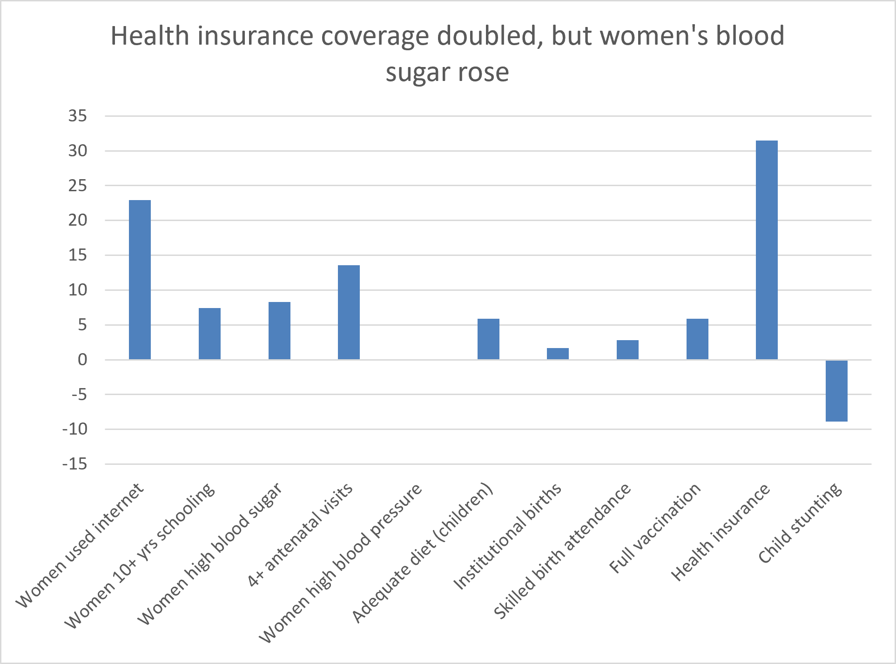
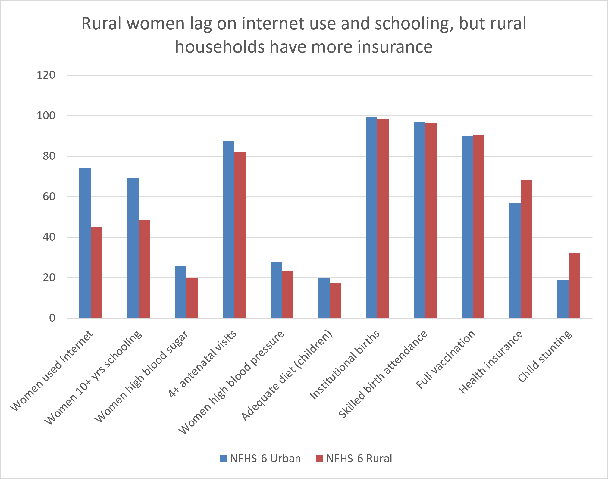

# Karnataka Health Indicators: NFHS-5 vs NFHS-6

## Project question
How did health coverage and maternal and child health in Karnataka change
from NFHS-5 to NFHS-6, and where does rural Karnataka still lag behind urban?

## Key findings
1. **Health insurance coverage almost doubled:** households with a member covered went from 31.8% to 63.3% (+31.5 points).
2. **More women are online:** women who have ever used the internet rose from 35.0% to 57.9% (+22.9 points).
3. **Better antenatal care:** mothers with at least 4 antenatal visits rose from 70.9% to 84.5% (+13.6 points).
4. **Child stunting fell:** stunted children under 5 went from 35.4% to 26.5% (-8.9 points), which is an improvement.
5. **A concern:** women with high blood sugar (or on medicine for it) rose from 14.0% to 22.3% (+8.3 points).

## Rural vs urban gaps (NFHS-6)
- Only 45.1% of rural women have used the internet, compared with 74.1% in urban areas (29.0 points lower).
- 48.3% of rural women have 10+ years of schooling, compared with 69.4% in urban areas (21.1 points lower).
- 32.0% of rural children under 5 are stunted, compared with 19.0% in urban areas (13.0 points higher).
- Health insurance is higher in rural households (68.1%) than urban (57.1%).

## Charts

## Recommendation
Rural Karnataka has caught up on insurance, so outreach should now focus on
rural women's education and digital access, child nutrition in rural areas,
and screening for high blood sugar.

## Data and method
- Source: NFHS-5 (2019-21) and NFHS-6 (2023-24) Karnataka state fact sheets.
- I picked 11 indicators across coverage, maternal care, child health, education and lifestyle.
- Calculated the change between surveys and the rural-urban gap, and made charts in Excel.
- Files: `working_data.xlsx` (analysis), `chart1_change.png`, `chart2_rural_urban.png`.

## Limitations
- This is state-level data, not district-level.
- NFHS-6 data may be provisional.
- Indicator 42 was removed because the source had an invalid value.
- Survey changes show association, not cause.
- For some indicators (stunting, blood sugar), a higher number is worse.

## Next steps
Extend to district-level data and build a Power BI dashboard with a map.
